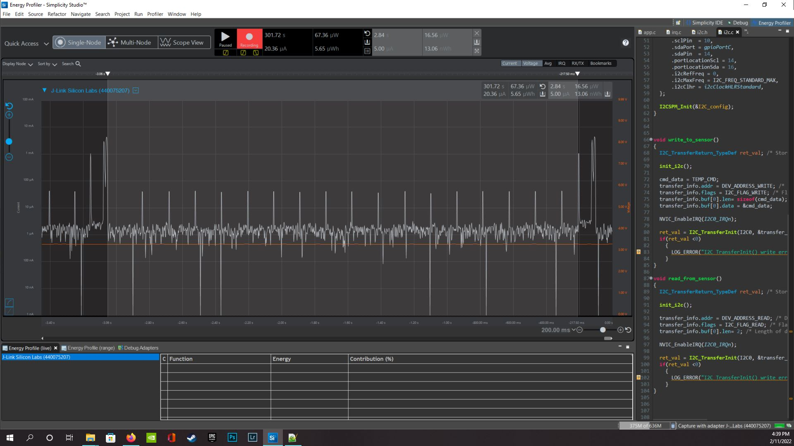
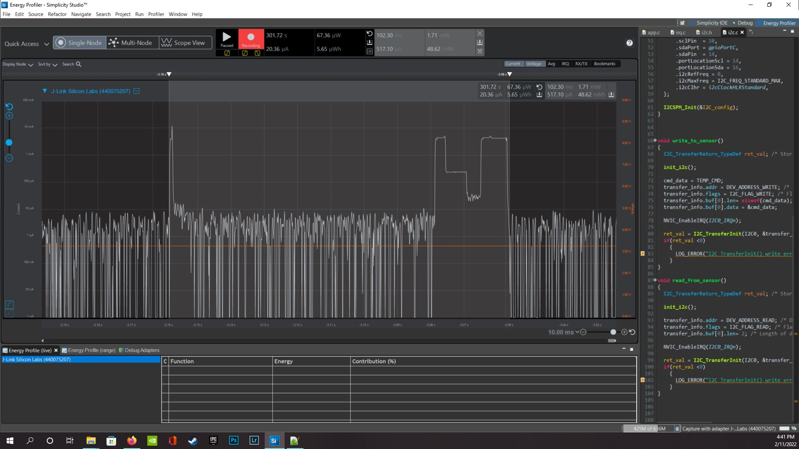

Please include your answers to the questions below with your submission, entering into the space below each question
See [Mastering Markdown](https://guides.github.com/features/mastering-markdown/) for github markdown formatting if desired.

*Be sure to take measurements with logging disabled to ensure your logging logic is not impacting current/time measurements.*

*Please include screenshots of the profiler window detailing each current measurement captured.  See the file Instructions to add screenshots in assignment.docx in the ECEN 5823 Student Public Folder.* 

1. What is the average current per period?
   Answer: 19.60uA
    Screenshot:  
   ![Avg_current_per_period] (Assignment4/ss_question1.JPG)

2. What is the average current when the Si7021 is Powered Off?
   Answer: 5uA
    Screenshot:  
     

3. What is the average current when the Si7021 is Powered On?
   Answer: 517.10uA
    Screenshot:  
     

4. How long is the Si7021 Powered On for 1 temperature reading?
   Answer: 102.30ms
    Screenshot:  
     

5. Compute what the total operating time of your design for assignment 4 would be in hours, assuming a 1000mAh battery power supply?
   Answer: If avg current consumption is taken as 19.60uA, the total operating time would be *(1000(mAh)/ (19.6*10^(-6)*1000))* = 51020 hours (approx 6 years)
   
6. How has the power consumption performance of your design changed since the previous assignment?
   Answer: The current consumption has reduced by 7 times. From 144uA to 19.6uA. This has resulted in both energy and power consumption.
   
7. Describe how you tested your code for EM1 during I2C transfers
	Answer: I compared the current consumption during I2c transfers to the readings taken in Assignment 2. In EM1 the current consumption is in mA, rest of the time the current is in uA. 
